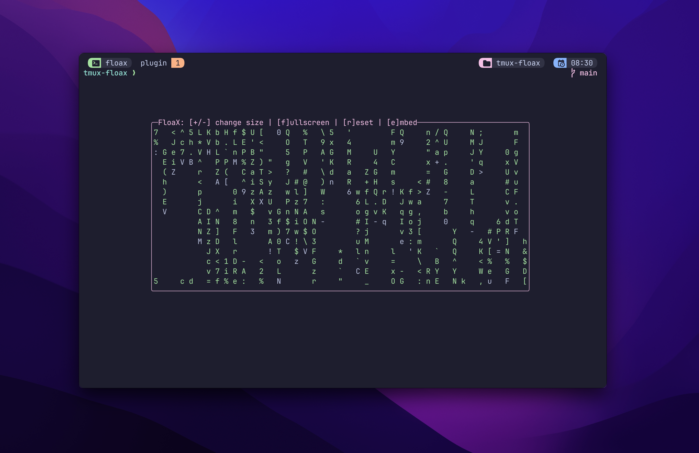

FloaX - Floating panes in Tmux!
============

🛑 Looking for help!
Floax needs your help, looking for assistance maintaining this repo, issues and pull requests.
Please email me at hi@omerxx.com 🙏



## Install 💻

Tmux version 3.3 or newer is required to use this plugin.

Add this to your `.tmux.conf` and run `<prefix>+I` for TPM to install the plugin.
```conf
set -g @plugin 'omerxx/tmux-floax'
```

## Using the internal menu 📃
The menu (set with `@floax-bind-menu` and defaults to `<prefix>+P`) will appear when running a floating pane.
When triggered from a non floating window, the only option currently is to pop the window out to the floating pane.
Unless disabled, the same keys are also bound to the root table (can be used without Tmux prefix) only when using the floating pane.
The options are also listed in the title (unless it was configured differently).
Standard menu options (followed by their hotkey):
- Size down (-): Decrease overall size
- Size up (+): Increase overall size
- Fullscreen: Toggles the pane to 100% of the screen's space
- Reset: Sets the pane's size back to the default settings
- Embed: sends the floating panes window to the working space under it

## Configure ⚙️

The default binding for this plugin is `<prefix>+p` (and `<prefix>+P` for the internal menu)
You can change it by adding this line with your desired key:

```bash
set -g @floax-bind '<mykey>'
```

### Root Binding

If you want to toggle floax without `<prefix>` (e.g. `Alt+p`), you can do so by prepending `-n`:

```bash
# M- means "hold Meta/Alt"
set -g @floax-bind '-n M-p'
```

### Additional configuration options:

```bash
# Setting the main key to toggle the floating pane on and off
set -g @floax-bind '<my-key>'

# When the pane is toggled, using this bind pops a menu with additional options
# such as resize, fullscreen, resetting to defaults and more.
set -g @floax-bind-menu 'P'

# The default width and height of the floating pane
set -g @floax-width '80%'
set -g @floax-height '80%'

# The border color can be changed, these are the colors supported by Tmux:
# black, red, green, yellow, blue, magenta, cyan, white for the standard
# terminal colors; brightred, brightyellow and so on for the bright variants;
# colour0/color0 to colour255/color255 for the colors from the 256-color
# palette; default for the default color; or a hexadecimal RGB color such as #882244.
set -g @floax-border-color 'magenta'

# The text color can also be changed, by default it's blue 
# to distinguish from the main window
# Optional colors are as shown above in @floax-border-color
set -g @floax-text-color 'blue'

# By default when floax sees a change in session path 
# it'll change the floating pane's path
# You can disable this by setting it to false
# You could also "cd -" when the pane is toggled to go back
set -g @floax-change-path 'true'

# The default session name of the floating pane is 'scratch'
# You can modify the session name with this option:
set -g @floax-session-name 'some-other-session-name'

# Change the title of the floating window
set -g @floax-title 'floax'
```

## Known issues 🐞
- ~Sizing too much down will break the script~

## Contributors 🙌

<a href="https://github.com/omerxx/tmux-floax/graphs/contributors">
  
</a>

Made with [contrib.rocks](https://contrib.rocks).
